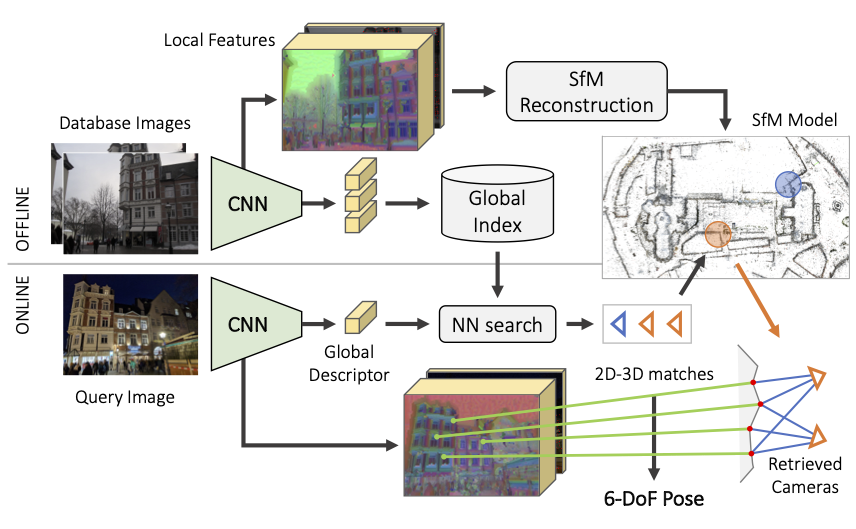
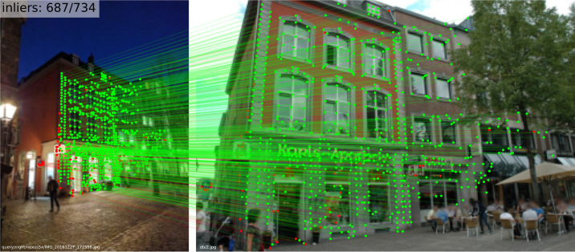
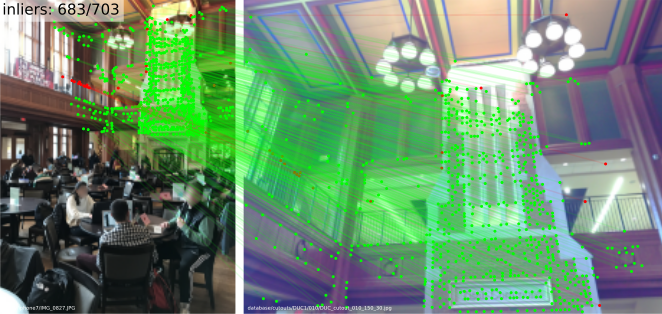
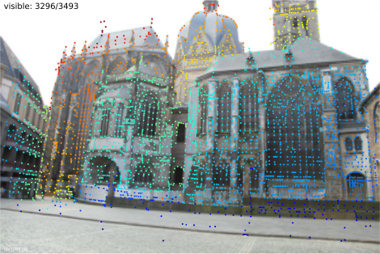

# hloc - the hierarchical localization toolbox

[Original repository](https://github.com/cvg/Hierarchical-Localization)

# Obtaining repository

git clone https://github.com/cds-mipt/hierarchical_localization.git --recurse-submodules

[Google doc](https://docs.google.com/document/d/1-XJtUBoMRR9-k_bm_41uVAezRGeQiOKCvSK3t2bo1e4/edit?usp=sharing) с кратким описанием работы Hierarchical localization.

This is `hloc`, a modular toolbox for state-of-the-art 6-DoF visual localization. It implements [Hierarchical Localization](https://arxiv.org/abs/1812.03506), leveraging image retrieval and feature matching, and is fast, accurate, and scalable. This codebase won the indoor/outdoor [localization challenge at CVPR 2020](https://sites.google.com/view/vislocslamcvpr2020/home), in combination with [SuperGlue](https://psarlin.com/superglue/), our graph neural network for feature matching.

With `hloc`, you can:

- Reproduce [our CVPR 2020 winning results](https://www.visuallocalization.net/workshop/cvpr/2020/) on outdoor (Aachen) and indoor (InLoc) datasets
- Run Structure-from-Motion with SuperPoint+SuperGlue to localize with your own datasets
- Evaluate your own local features or image retrieval for visual localization
- Implement new localization pipelines and debug them easily 🔥

<p align="center">
  <a href="https://arxiv.org/abs/1812.03506"></a>
  <br /><em>Hierachical Localization uses both image retrieval and feature matching</em>
</p>

##

## Installation with Docker

```
docker build -t hloc:latest .
docker run -it --rm -p 8888:8888 hloc:latest  # for GPU support, add `--runtime=nvidia`
jupyter notebook --ip 0.0.0.0 --port 8888 --no-browser --allow-root
```


## General pipeline

The toolbox is composed of scripts, which roughly perform the following steps:

1. Extract SuperPoint local features for all database and query images
2. Build a reference 3D SfM model
   1. Find covisible database images, with retrieval or a prior SfM model
   2. Match these database pairs with SuperGlue
   3. Triangulate a new SfM model with COLMAP
3. Find database images relevant to each query, using retrieval
   1. [NetVLAD repository in pytorch](https://github.com/Nanne/pytorch-NetVlad) 
4. Match the query images with SuperGlue
5. Run the localization
6. Visualize and debug

The localization can then be evaluated on [visuallocalization.net](https://www.visuallocalization.net/) for the supported datasets. When 3D Lidar scans are available, such as for the indoor dataset InLoc, step 2. can be skipped.

Strcture of the toolbox:

- `hloc/*.py` : top-level scripts
- `hloc/extractors/` : interfaces for feature extractors
- `hloc/matchers/` : interfaces for feature matchers

## Tasks

We provide step-by-step guides to localize with Aachen, InLoc, and to generate reference poses for your own data using SfM. Just download the datasets and you're reading to go!

### Aachen – outdoor localization

Have a look at [`pipeline_Aachen.ipynb`](https://nbviewer.jupyter.org/github/cvg/Hierarchical-Localization/blob/master/pipeline_Aachen.ipynb) for a step-by-step guide on localizing with Aachen. Play with the visualization, try new local features or matcher, and have fun! Don't like notebooks? You can also run all scripts from the command line.

<p align="center">
  <a href="https://nbviewer.jupyter.org/github/cvg/Hierarchical-Localization/blob/master/pipeline_Aachen.ipynb"></a>
</p>

### InLoc – indoor localization

The notebook [`pipeline_InLoc.ipynb`](https://nbviewer.jupyter.org/github/cvg/Hierarchical-Localization/blob/master/pipeline_InLoc.ipynb) shows the steps for localizing with InLoc. It's much simpler since a 3D SfM model is not needed.

<p align="center">
  <a href="https://nbviewer.jupyter.org/github/cvg/Hierarchical-Localization/blob/master/pipeline_InLoc.ipynb"></a>
</p>

### SfM reconstruction from scratch

We show in [`pipeline_SfM.ipynb`](https://nbviewer.jupyter.org/github/cvg/Hierarchical-Localization/blob/master/pipeline_SfM.ipynb) how to run 3D reconstruction for an unordered set of images. This generates reference poses, and a nice sparse 3D model suitable for localization with the same pipeline as Aachen.

## BibTex Citation

If you report any of the above results in a publication, or use any of the tools provided here, please consider citing both [Hierarchical Localization](https://arxiv.org/abs/1812.03506) and [SuperGlue](https://arxiv.org/abs/1911.11763) papers:

```
@inproceedings{sarlin2019coarse,
  title     = {From Coarse to Fine: Robust Hierarchical Localization at Large Scale},
  author    = {Paul-Edouard Sarlin and
               Cesar Cadena and
               Roland Siegwart and
               Marcin Dymczyk},
  booktitle = {CVPR},
  year      = {2019}
}

@inproceedings{sarlin2020superglue,
  title     = {{SuperGlue}: Learning Feature Matching with Graph Neural Networks},
  author    = {Paul-Edouard Sarlin and
               Daniel DeTone and
               Tomasz Malisiewicz and
               Andrew Rabinovich},
  booktitle = {CVPR},
  year      = {2020},
}
```

## Going further

### Debugging and Visualization

<details>
<summary>[Click to expand]</summary>

Each localization run generates a pickle log file. For each query, it contains the selected database images, their matches, and information from the pose solver, such as RANSAC inliers. It can thus be parsed to gather statistics and analyze failure modes or difficult scenarios. 

We also provide some visualization tools in [`hloc/visualization.py`](./hloc/visualization.py) to visualize some attributes of the 3D SfM model, such as visibility of the keypoints, their track length, or estimated sparse depth (like below).

<p align="center">
  <a href="./pipeline_Aachen.ipynb"></a>
</p>
</details>

### Using your own local features or matcher

<details>
<summary>[Click to expand]</summary>

If your code is based on PyTorch: simply add a new interface in [`hloc/extractors/`](hloc/extractors/) or [`hloc/matchers/`](hloc/matchers/). It needs to inherit from `hloc.utils.base_model.BaseModel`, take as input a data dictionary, and output a prediction dictionary. Have a look at `hloc/extractors/superpoint.py` for an example. You can additionally define a standard configuration in [`hloc/extract_features.py`](hloc/extract_features.py) or [`hloc/match_features.py`](hloc/match_features.py) - it can then be called directly from the command line.

If your code is based on TensorFlow: you will need to either modify `hloc/extract_features.py` and `hloc/match_features.py`, or export yourself the features and matches to HDF5 files, described below.

In a feature file, each key corresponds to the relative path of an image w.r.t. the dataset root (e.g. `db/1.jpg` for Aachen), and has one dataset per prediction (e.g. `keypoints` and `descriptors`, with shape Nx2 and DxN). 

In a match file, each key corresponds to the string `path0.replace('/', '-')+'_'+path1.replace('/', '-')` and has a dataset `matches0` with shape N. It indicates, for each keypoint in the first image, the index of the matching keypoint in the second image, or `-1` if the keypoint is unmatched.
</details>

### Using your own image retrieval

<details>
<summary>[Click to expand]</summary>

For now `hloc` does not have an interface for image retrieval. You will need to export the global descriptors into an HDF5 file, in which each key corresponds to the relative path of an image w.r.t. the dataset root, and contains a dataset `global_descriptor` with size D. You can then export the images pairs with [`hloc/pairs_from_retrieval.py`](hloc/pairs_from_retrieval.py).
</details>

## Contributions welcome!

External contributions are very much welcome. This is a non-exaustive list of features that might be valuable additions:

- [ ] more localization datasets (RobotCar Seasons, CMU Seasons, Aachen v1.1, Cambridge Landmarks, 7Scenes)
- [ ] covisibility clustering for InLoc
- [ ] visualization of the raw predictions (features and matches)
- [ ] interfaces for image retrieval (e.g. [DIR](https://github.com/almazan/deep-image-retrieval), [NetVLAD](https://github.com/uzh-rpg/netvlad_tf_open))
- [ ] other local features

Created and maintained by [Paul-Edouard Sarlin](https://psarlin.com/).
